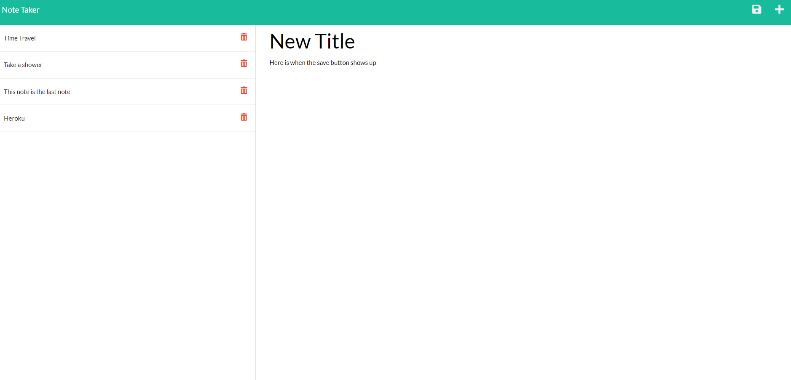

# Note-Taker-Express

## Purpose
Create the get/post/delete routes using express.js for a note-taker app

## Collaborators
[link](https://bobbyhadz.com/blog/javascript-array-find-index-of-object-by-property) This blog helped me figure out how to get the index of an object in an array by using the id.
[link](https://www.tabnine.com/code/javascript/functions/express/Router/delete) Found how to write a delete request through this link.
[UNIQID](https://www.npmjs.com/package/uniqid) npm package I used to create a unique id for each note.

## User Story
AS A small business owner
I WANT to be able to write and save notes
SO THAT I can organize my thoughts and keep track of tasks I need to complete

## Acceptance Criteria
GIVEN a note-taking application
WHEN I open the Note Taker
THEN I am presented with a landing page with a link to a notes page
WHEN I click on the link to the notes page
THEN I am presented with a page with existing notes listed in the left-hand column, plus empty fields to enter a new note title and the note’s text in the right-hand column
WHEN I enter a new note title and the note’s text
THEN a Save icon appears in the navigation at the top of the page
WHEN I click on the Save icon
THEN the new note I have entered is saved and appears in the left-hand column with the other existing notes
WHEN I click on an existing note in the list in the left-hand column
THEN that note appears in the right-hand column
WHEN I click on the Write icon in the navigation at the top of the page
THEN I am presented with empty fields to enter a new note title and the note’s text in the right-hand column

## Built With
Javascript, HTML, CSS, Express.js, UNIQID 

## Screenshot
